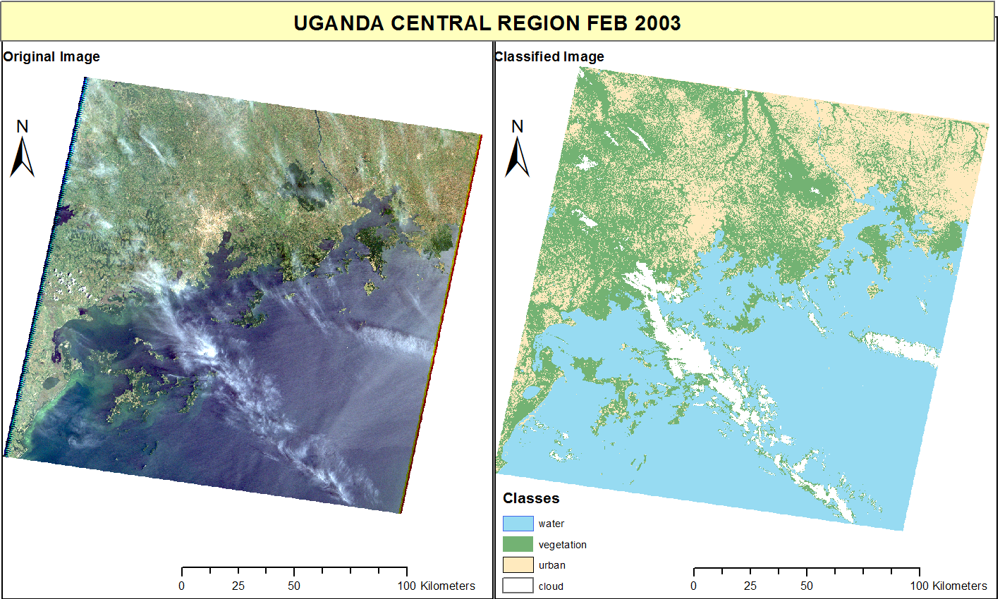
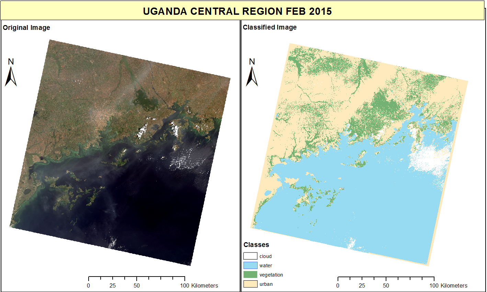
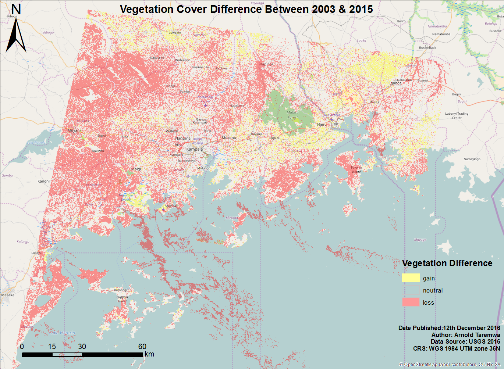

Title: Green Cover Loss in Central Uganda
Date: 2016-11-20 10:20
Category: Maps
Tags: GIS, classification, SGDs
Slug: green-cover-loss-kampala
Summary: Change in green cover in Central Uganda over time

Vegetation cover all over the world has been on the decline for many years now. We all know this. The UN points out forest area loss from 31.7 % of the world's total land mass to 30.7 % between 1990 and 2015 ([Sustainable Development Goal 15](https://sustainabledevelopment.un.org/sdg15)). But when its a gradual process, it can be hard to notice within your neighbourhood.  
The reclamation of a wetland along my way to Kampala city, one that I found serene for the longest time, pushed me to see how much the growing population was affecting vegetation in the area.  
I did some image classification of Landsat images from 2003 and 2015 of Central Uganda to map areas of green cover(this included anything with the colour green; trees, shrubs, wetlands, gardens etc) in the area. This was a simple project, but I found the resulting difference in green cover to be significant enough.  

